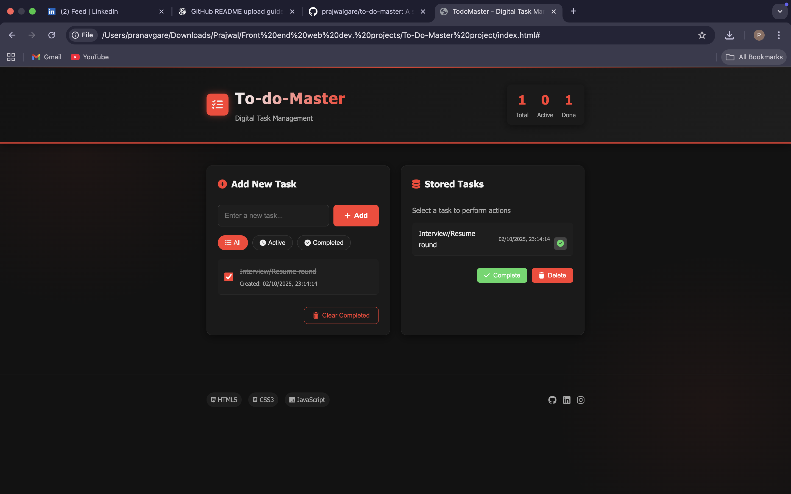
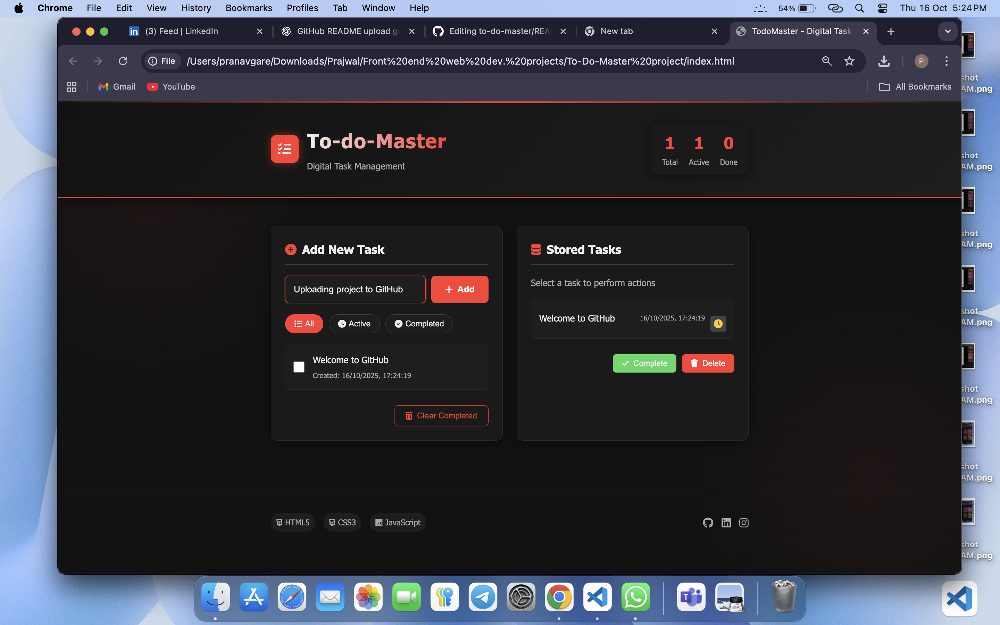
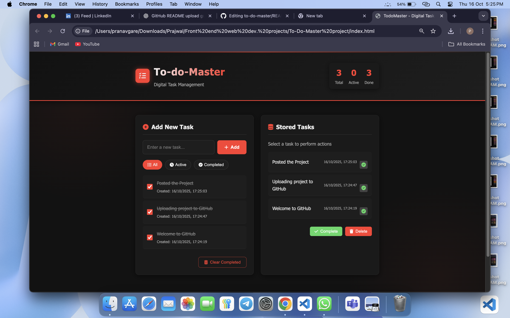

# 📝 To-Do Master

A simple and responsive To-Do application built using **HTML, CSS, and JavaScript**, featuring task creation, editing, deletion, filtering, and local persistence via LocalStorage.

## 🚀 Live Demo
👉 [View Live App](https://prajwalgare.github.io/to-do-master)
## 🖼️ Screenshots

### Viewpage To-do-Master/enter a new task

### ➕ Add Task View

### ✅ Completed Tasks View

## 🔧 Features
- Add, edit, and delete tasks
- Mark tasks as complete/incomplete
- Filter tasks (All / Active / Completed)
- Saves tasks automatically in your browser
- Responsive design for mobile and desktop

## 🧰 Tech Stack
- HTML5
- CSS3
- JavaScript (Vanilla)

## 📂 Project Structure
/to-do-master
├── index.html
├── style.css
└── script.js

## 🧑‍💻 Author
**Prajwal Gare**  
GitHub: [@prajwalgare](https://github.com/prajwalgare)
